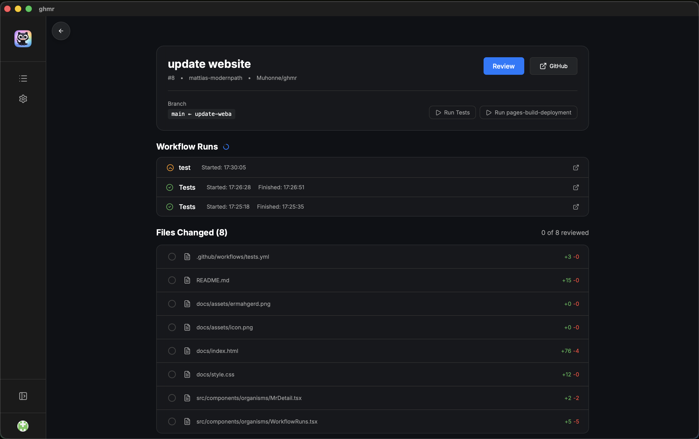

# ghmr - GitHub Merge Request Viewer

**[Live Website](https://muhonne.github.io/ghmr/)**


Naming is hard, this is a Git Hub Merge Request -viewer so in short: GHMR.

A secure, lightweight desktop application for reviewing GitHub Pull Requests with an optimized keyboard-first workflow.

## Showcase

| MR Details & Workflow Status | High-Speed Review Mode |
|:---:|:---:|
|  |  |

## Core Features
- [x] **Desktop App**: Built with Tauri for a secure, native experience
- [x] **🔒 Encrypted Storage**: GitHub tokens stored using encrypted Tauri store (not plaintext!)
- [x] **🔒 Security Hardened**: Strict CSP, HTML sanitization, input validation
- [x] **GitHub Integration**: Authenticate using Personal Access Tokens
- [x] **MR Discovery**: Automatically fetch open Pull Requests authored by you
- [x] **File Browser**: Detailed list of files changed with addition/deletion stats

## Review Mode
- [x] **Side-by-Side Diff**: High-fidelity diff viewer with syntax highlighting
- [x] **Keyboard First**: Optimized for speed with comprehensive shortcuts
    - `Arrows` / `JK`: Navigate between files
    - `Enter` / `Space`: Mark file as viewed and move to next
    - `Backspace`: Go back and unmark file
    - `Esc`: Exit review mode
    - `Cmd+R`: Refresh MR list (debounced)
- [x] **Progress Tracking**: Visual progress bar for reviewed files
- [x] **Persistent State**: Viewed files persist across sessions

## Security Features 🔐


This application implements enterprise-grade security:

- ✅ **Encrypted Token Storage** - Uses Tauri's encrypted store plugin
- ✅ **Content Security Policy (CSP)** - Prevents XSS attacks
- ✅ **HTML Sanitization** - All user content sanitized with DOMPurify
- ✅ **Token Validation** - Validates GitHub token format before use
- ✅ **HTTPS Enforcement** - All API calls use HTTPS only
- ✅ **Rate Limiting** - Debounced API requests prevent quota exhaustion
- ✅ **No Console Logs in Production** - Stripped during build
- ✅ **No Telemetry** - All data stays on your device


## Tech Stack

- **Frontend**: React + TypeScript + Vite
- **Desktop**: Tauri (Rust)
- **Diff Viewer**: react-diff-viewer-continued
- **Syntax Highlighting**: Prism.js
- **Security**: DOMPurify, Tauri Store Plugin

## Installation

### Prerequisites
- Node.js 18+
- Rust toolchain (for building)

### Build
```bash
npm install
npm run tauri:build
```

### Development
```bash
npm install
npm run tauri:dev
```

## Landing Page Setup
The project landing page is located in the `/docs` directory and is hosted via **GitHub Pages**.

To update the landing page:
1. Modify `docs/index.html` or `docs/style.css`.
2. Ensure images are placed in `docs/assets/`.
3. Commit and push to the `main` branch.
4. In GitHub Repository Settings, ensure **GitHub Pages** is set to build from the `/docs` folder on the `main` branch.

## Releases & CI/CD
The project uses GitHub Actions for automated testing and cross-platform releases.

### Automated Testing
Every push and pull request triggers the test suite via `.github/workflows/tests.yml`.

### Creating a Release
To create a new multi-platform release (macOS, Windows, Linux):
1. Update the version in `package.json` and `src-tauri/tauri.conf.json`.
2. Create and push a version tag:
   ```bash
   git tag v0.1.0
   git push origin v0.1.0
   ```
3. The "Release" workflow will automatically build the binaries and create a **Draft Release** on GitHub.
4. Review the draft and publish it once ready.

## Roadmap
- [x] CI/CD Status integration (Workflow Runs)
- [ ] cmd+c of selected text should copy a string "filename:line <selection>"
- [ ] Code signing for macOS distribution
- [ ] Auto-update mechanism
